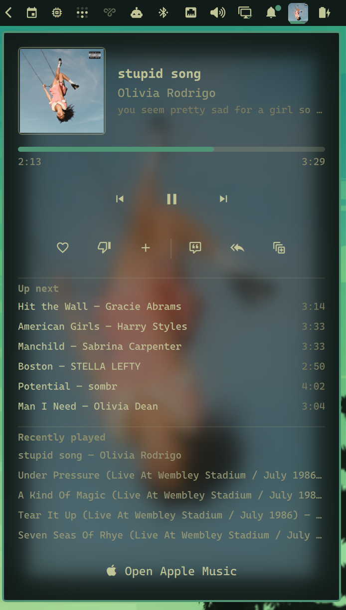

# Omarchy Apple Music

Apple Music Web as a first-class [Omarchy 4.0](https://omarchy.org/) bar widget.



The plugin keeps authentication, DRM, library access, and playback in the official Apple Music web player. It uses Quickshell's native MPRIS integration for now-playing information and controls.

## Features

- Dedicated Chromium app/profile for reliable Apple Music detection
- Hides itself from the bar when Apple Music is not running
- Launch or focus Apple Music from the bar
- Track title, artist, album, and artwork
- Previous, play/pause, and next controls
- Like and dislike for the current song, synced to the Apple Music library
- Up-next queue with click-to-jump
- Recently played history, persisted across shell and machine restarts
- Shuffle, repeat (off/all/one), and autoplay controls, synced with Apple Music
- Recently played entries replay the exact song (old entries keep working)
- Add the current song to the Apple Music library, with truthful state
- Player panel with a blurred artwork backdrop

## Requirements

- Omarchy 4.0
- Chromium
- python3 (standard library only, no packages)
- An Apple Music subscription

`playerctl` is not required.

## Install

```bash
omarchy plugin add https://github.com/iuliansafta/omarchy-apple-music.git --enable
```

Add the widget to the bar if your Omarchy version does not place it automatically:

```bash
omarchy plugin enable iuliansafta.apple-music center
```

### First launch and sign-in

The widget is hidden on a fresh install, so start the web app once. Any of these work:

```bash
# Click the Apple Music widget in the bar (once it is visible)
~/.config/omarchy/plugins/iuliansafta.apple-music/scripts/apple-music open
omarchy-shell iuliansafta.apple-music open
```

After the window opens the widget appears automatically (within a couple of seconds). To keep the widget reserved in the bar even when Apple Music is closed, set `hideWhenNotRunning` to `false` in the widget's shell.json entry or via Omarchy's settings UI.

Sign in inside the opened window with your Apple ID (two-factor authentication works as usual — the confirmation code prompt appears in the same window). Credentials are stored in the plugin's isolated Chromium profile at `~/.local/share/omarchy-apple-music/chromium-profile`, so you stay signed in across restarts and the login never touches your normal browser profile. Without an active Apple Music subscription you can browse the library, but playback is limited to previews.

### Add Apple Music to the app launcher

To also start Apple Music from the application launcher (SUPER + SPACE), either use the plugin's own installer — recommended, because it registers the dedicated app with its bundled extension:

```bash
~/.config/omarchy/plugins/iuliansafta.apple-music/scripts/apple-music install
```

Or create a web app the generic Omarchy way, pointing its `custom-exec` at the plugin's launcher so the extension and the bridge daemon still load:

omarchy webapp install "Apple Music" https://music.apple.com \
  "$HOME/.config/omarchy/plugins/iuliansafta.apple-music/assets/apple-music.svg" \
  "$HOME/.config/omarchy/plugins/iuliansafta.apple-music/scripts/apple-music open"
```

Remove it again with `omarchy webapp remove "Apple Music"`.

A plain `omarchy webapp install "Apple Music" https://music.apple.com apple-music` (without the custom exec) opens music.apple.com in a generic app window on your normal Chromium profile. The bar widget's playback controls may work, but the bundled extension will not load — so the HLS duration fix, ratings, and queue features are unavailable.

## Controls

- Click while closed: launch/focus Apple Music
- Click while connected: open the player panel
- Middle-click: play/pause
- Scroll up/down: previous/next

## Progress handling

Some Apple Music HLS tracks expose `Infinity` as the HTML audio duration even though MusicKit's queue contains the real catalog duration. Chromium converts that infinity to the maximum signed 64-bit MPRIS value.

The plugin bundles a minimal extension, restricted to `https://music.apple.com/*`, that republishes MusicKit's `durationInMillis` through the standard Media Session API. This restores MPRIS progress and seeking. It uses Apple Music's private MusicKit queue object, so a future Apple Music Web update may require an adjustment. Invalid values still fall back safely to elapsed time with `--:--`.

## Ratings and queue

Chromium's Media Session cannot carry ratings or queue contents, so those travel a different path: the bundled extension also exposes a `collect`/`command` hook on the page, and a small daemon (`scripts/bridge-daemon`, spawned by the plugin service) relays it over Chromium's DevTools protocol — which the dedicated browser enables with `--remote-debugging-port=0` on a localhost-only port. Ratings are read and written through Apple Music's own ratings API with the tokens MusicKit already holds in the page. If Apple Music Web changes its internals, rating and queue features degrade to hidden while duration bridging and playback controls keep working.

## Playback modes

The player panel has a shuffle / repeat / autoplay row next to the rating controls. All three are read from and written through MusicKit on the Apple Music page (the single source of truth — Chromium's Media Session cannot carry them, and MPRIS has no autoplay concept), so the controls always show the state Apple Music itself reports, including changes made inside Apple Music. Repeat cycles Off → Repeat All → Repeat One → Off. When the bridge is unavailable the row hides and ordinary MPRIS transport keeps working.

Autoplay means Apple Music's infinite continuation of the queue (recommended tracks after your queue ends), not automatic application launch.

## Recently played

Recently played entries persist across shell and machine restarts in `~/.local/share/omarchy-apple-music/history.jsonl`. New entries recorded while the bridge is active carry an exact-song descriptor (catalog/library song IDs from MusicKit); clicking such an entry replaces Apple Music's current playback with that exact song — never a title/artist guess — and lets Apple Music establish its normal continuation. Entries recorded before this feature (or while the bridge was unavailable) remain listed but only focus Apple Music when clicked.

## Add to library

The library button next to the rating controls adds the currently audible song to your Apple Music library. It is a distinct action from like/dislike: membership is read from Apple's own library API (matched by exact catalog ID, never by title), and the button only offers an add when Apple reports the song as absent. Pending adds show a waiting state and cannot trigger duplicate writes; the check mark appears only once Apple's library actually reflects the song. Failure and unknown states stay non-committal instead of claiming success. Removal is not offered — Apple's web API does not allow it from the browser.

## Remove

```bash
omarchy plugin remove iuliansafta.apple-music
```

The isolated browser profile remains at:

```text
~/.local/share/omarchy-apple-music/chromium-profile
```

Remove it manually only if you also want to delete its Apple Music login and browser data.

## Development

See [`docs/DEVELOPMENT.md`](docs/DEVELOPMENT.md).

## License

[MIT](LICENSE)
